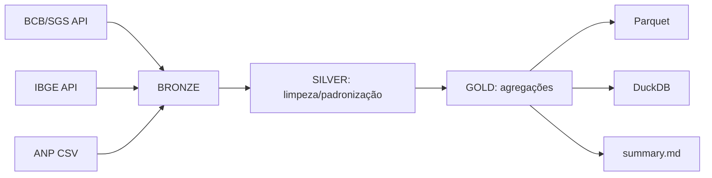

# ETL MacroPulse Brasil (BCB + IBGE + ANP)

Pipeline ETL end-to-end em Python com arquitetura **Bronze / Silver / Gold**, consolidando dados públicos do **BCB (SGS)**, **IBGE** e **ANP**.  
Saídas em **Parquet** (incluindo partição no Gold) e **DuckDB**, além de um resumo automático (`summary.md`) baseado em regras (sem IA).

---

## Visão geral

- **Extract:** BCB/SGS (API) + IBGE (API) + ANP (CSV local)
- **Transform:** padronização de schema/tipos, deduplicação e agregações mensais
- **Load:** Parquet (silver/gold) + DuckDB + `summary.md`

## Arquitetura de dados:

data/

  bronze/  -> dados brutos (raw)
  
   silver/  -> dados limpos e padronizados
  
   gold/    -> agregações e produtos finais (data marts + summary)

## Como rodar

**1) Instalar dependências:**

pip install -r requirements.txt

**2) Configurar entradas:**

- inputs/bcb_series.csv (códigos de séries SGS)

- inputs/run_config.json (intervalo de datas e caminhos)

- Baixar o CSV da ANP e salvar em: data/bronze/anp_precos.csv

**3) Executar o pipeline:**

python src/main.py

**Outputs gerados:**

- data/silver/bcb_sgs.parquet

- data/silver/anp_prices.parquet

- data/silver/dim_uf.parquet

- data/gold/bcb_monthly/

- data/gold/anp_monthly/

- data/gold/summary.md

- data/macropulse.duckdb

**Exemplo de resumo**

Veja: data/gold/summary.md

**Estrutura do projeto:**

inputs/     -> arquivos de configuração e controle do pipeline

src/        -> extract/transform/load/summary + orquestração

notebooks/  -> demonstração passo a passo

state/      -> controle de estado (incremental / rastreabilidade)

data/       -> saídas do pipeline (não versionado, exceto summary.md)

**Fontes de dados:**

BCB/SGS: séries temporais via API bcdata.sgs

IBGE: localidades (UF/Regiões)

ANP: série histórica de preços de combustíveis (CSV)

